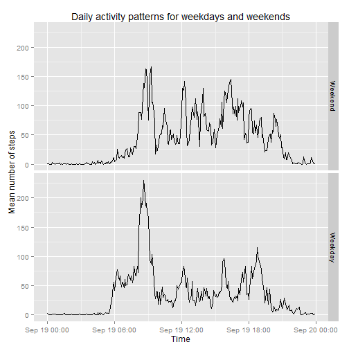

## Loading and preprocessing the data

```r
library(dplyr)
library(ggplot2)
if ("activity.csv" %in% dir() == FALSE) { # unzip the file if this has not been done already
  unzip("activity.zip")
}
data <- read.csv("activity.csv", colClasses = c("integer", "Date", "integer"))
```

## What is mean total number of steps taken per day?

```r
totals<-summarise(group_by(data,as.factor(date)),sum(steps,na.rm=T))#sum the steps per day
names(totals) <- make.names(c("date", "total steps"))
hist(totals$total.steps,
     main = "Histogram of total number of steps per day (excluding missing values)",
     xlab = "Total number of steps per day")
```

 

```r
mean(totals$total.steps)
```

```
## [1] 9354.23
```

```r
median(totals$total.steps)
```

```
## [1] 10395
```

## What is the average daily activity pattern?

```r
intervalMeans<-summarise(group_by(data,interval),mean(steps,na.rm=T))#take the mean per interval
names(intervalMeans) <- c("interval", "mean")
intervalMeans<-mutate(intervalMeans,interval=formatC(interval,width=4,format="d",flag="0"))
intervalMeans$time<-strptime(intervalMeans$interval,format = "%H%M")#reformat intervals to plot
plot(intervalMeans$time, intervalMeans$mean,
     type="l",
     main = "Daily activity pattern",
     xlab = "Time",
     ylab = "Mean number of steps")
```

 

```r
maxMean <- max(intervalMeans$mean, na.rm=T) # maximum mean value per interval
intervalMeans[intervalMeans$mean == maxMean, 1:2] # interval corresponding to the maximum
```

```
## Source: local data frame [1 x 2]
## 
##   interval     mean
## 1     0835 206.1698
```


## Imputing missing values

```r
data$missing <- is.na(data$steps) # create logical column indicating missing values (interval and date have no missing values)
sum(data$missing) # count missing values
```

```
## [1] 2304
```

```r
replace <- vector() # existing values plus the mean of the appropriate interval for missing values
for(i in 1:nrow(data)) {
  if(data$missing[i]) {
    replace[i]<-as.numeric(intervalMeans[as.numeric(intervalMeans$interval)==data$interval[i], 2])
  } else {
    replace[i] <- data$steps[i]
  }
}
filledData<-data.frame(replace, data$date, data$interval) # new dataset with missing values filled
names(filledData) <- names(data)[1:3]
filledTotals<-summarise(group_by(filledData,as.factor(date)),sum(steps, na.rm=T))#repeat second chunk
names(filledTotals) <- make.names(c("date", "total steps"))
hist(filledTotals$total.steps,
     main = "Histogram of total number of steps per day (including missing values)",
     xlab = "Total number of steps per day") # much less positively skewed than first histogram
```

 

```r
mean(filledTotals$total.steps) # higher than the value without replacement
```

```
## [1] 10766.19
```

```r
median(filledTotals$total.steps) # slightly higher than before and very close to the mean
```

```
## [1] 10766.19
```


## Are there differences in activity patterns between weekdays and weekends?

```r
filledData$weekend <- weekdays(filledData$date) %in% c("Saturday", "Sunday") # logical indicating whether or not the day is a weekend
filledData$status<-factor(filledData$weekend,levels=c(TRUE,FALSE),labels=c("Weekend","Weekday")) # factor variable for splitting the data into weekends and weekdays
filledIntervalMeans <- summarise(group_by(filledData, interval, status), mean(steps)) # as above, but also grouping according to type of day
names(filledIntervalMeans) <- c("interval", "status", "mean")
class(filledIntervalMeans)<-class(intervalMeans) # otherwise the interval column cannot be altered
filledIntervalMeans<-mutate(filledIntervalMeans,
                            interval=formatC(interval,width=4,format="d",flag="0"))
filledIntervalMeans$time <- strptime(filledIntervalMeans$interval, format = "%H%M")
qplot(time, mean, data = filledIntervalMeans,
      facets = status ~ .,
      geom = "line",
      main = "Daily activity patterns for weekdays and weekends",
      xlab = "Time",
      ylab = "Mean number of steps") # ignore the date on the x-axis
```

 
